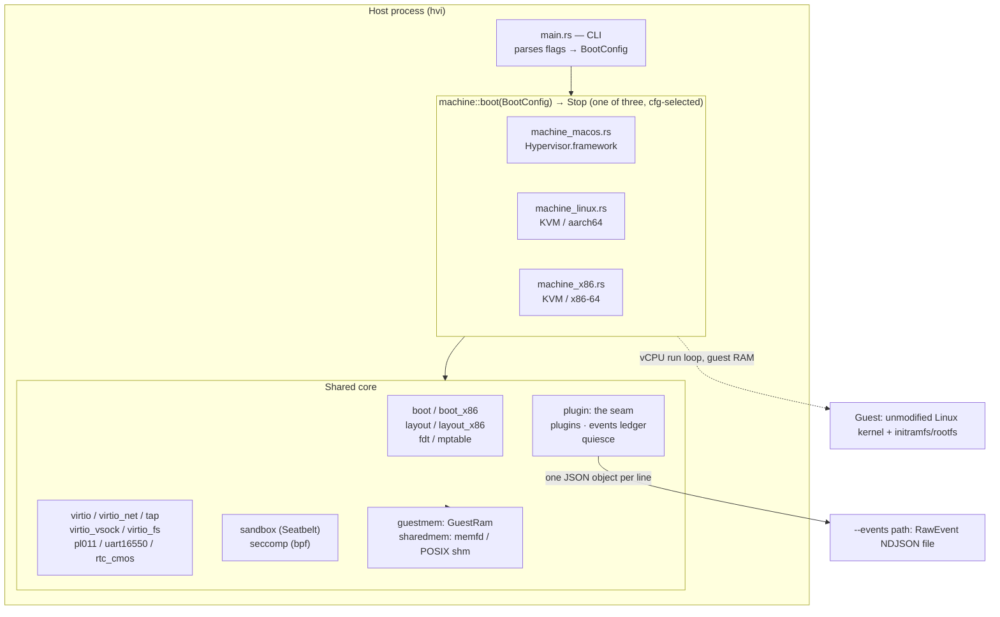
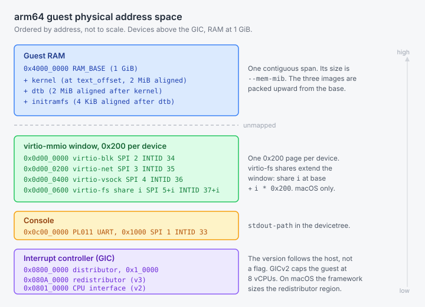
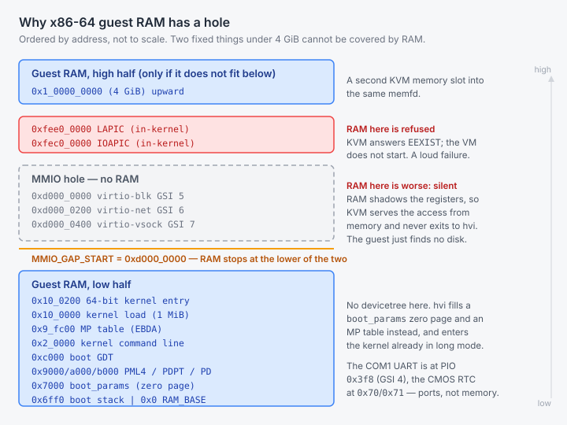
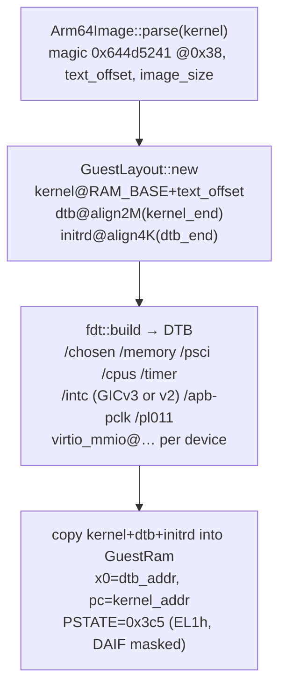
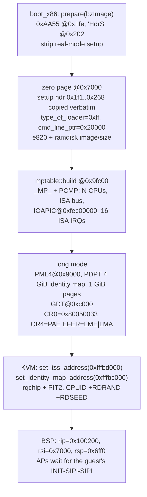
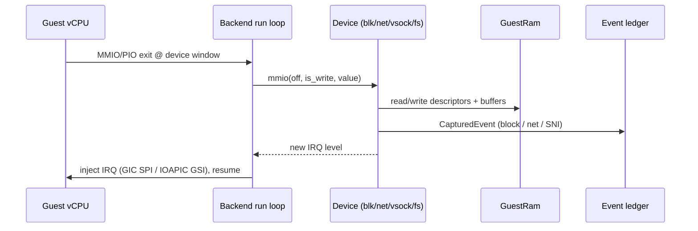

# Architecture

hvi runs an unmodified Linux kernel under one of three host backends behind a
single entry point, and it is itself the virtio backend, so a guest gets the
same device model wherever it runs.

This page describes the design. For attaching a tool, read
[plugins.md](plugins.md). For linking the library, read
[embedding.md](embedding.md).

## 1. Guests, hosts and backends

hvi separates the **guest architecture**, which decides the boot protocol,
from the **host backend**, which decides the hypervisor API. Three
combinations are built, selected at compile time by target triple.

| Guest | Host | Backend module | Hypervisor API |
| --- | --- | --- | --- |
| aarch64 | macOS, Apple silicon | `machine_macos.rs` | Hypervisor.framework (`applevisor`) |
| aarch64 | Linux | `machine_linux.rs` | KVM (`kvm-ioctls` 0.25) |
| x86-64 | Linux | `machine_x86.rs` | KVM (`kvm-ioctls` 0.25) |

Two kinds of difference cut across those three, and conflating them is the
usual mistake:

- **Host differences** live in the `machine_*` modules: creating the VM,
  mapping guest RAM, running vCPUs, injecting interrupts, and confinement.
- **Guest-architecture differences** live in the boot and layout modules, and
  they are larger. An arm64 guest gets an `Image`, a devicetree and PSCI. An
  x86-64 guest gets a `bzImage`, a `boot_params` page, an e820 map and an MP
  table. Some devices are architecture-specific too: PL011 against 16550, and
  a CMOS RTC that only x86 needs.

Porting to a new host backend means one new `machine_*` file. Porting to a new
guest architecture is a much larger job.

On any other host triple the crate builds without a backend, so the shared
code and its unit tests still compile everywhere. That build cannot run a
guest.



### The entry point

Every backend exposes the same signature:

```rust
pub fn boot(cfg: BootConfig) -> Result<Stop, Box<dyn std::error::Error>>;
```

`lib.rs` aliases the right one to `pub mod machine` by target, so the CLI and
a linking crate use the same call. `Stop` is `SystemOff` or `SystemReset`.

`SystemReset` stops the process. hvi never reboots a guest.

Two settings a caller supplies are not in `BootConfig`: the guest file
ownership (`virtio_fs::set_guest_ids`, process-global) and the `HVI_*`
environment variables. See
[embedding.md](embedding.md#configuration-outside-bootconfig).

## 2. Guest memory

`GuestRam` (`guestmem.rs`) is what makes the device models host-neutral: a
`Send + Sync` accessor over the host's mapping of guest RAM. Every device
reads and writes guest memory only through it.

The translation from guest-physical address to host offset is private. Every
accessor that takes a guest address goes through it and fails with an
`io::Error` on a range the guest does not own. Two methods do not take a guest
address and so do not: `scan()` walks the host mapping directly and maps its
hits back through the same split, and `host_addr()` returns the unchecked base
pointer for the zero-copy paths.

`host_ptr` is a bounds-checked raw pointer for the iovec paths. It replaced a
`&mut [u8]` borrow that a guest could alias by pointing two descriptors at one
address.

The mapping is allocated by `sharedmem.rs` from a memfd on Linux or a POSIX
shared-memory object on macOS, mapped `MAP_SHARED` and then handed to the
hypervisor: `hv_vm_map` on hvi's own pointer, or a KVM memory slot. It is
unlinked from the namespace once mapped, so an out-of-process tool handed the
descriptor can map the same pages read-only and nothing else can open them by
name.

### Guest memory maps



**aarch64** (`layout.rs`). Devices sit low, RAM at 1 GiB.

| Region | Address | Size | IRQ |
| --- | --- | --- | --- |
| PL011 UART | `0x0100_0000` | `0x1000` | SPI 1, INTID 33 |
| virtio-blk | `0x0200_0000` | `0x200` | SPI 2, INTID 34 |
| virtio-net | `0x0200_0200` | `0x200` | SPI 3, INTID 35 |
| virtio-vsock | `0x0200_0400` | `0x200` | SPI 4, INTID 36 |
| virtio-fs share `i` | `0x0200_0600 + i * 0x200` | `0x200` | SPI `5 + i`, INTID `37 + i` |
| GIC distributor | `0x0800_0000` | `0x1_0000` | |
| GIC redistributor (v3) | `0x080A_0000` | `0x2_0000` per vCPU | |
| GIC CPU interface (v2) | `0x0801_0000` | `0x1_0000` shared | |
| RAM | `0x4000_0000` | `--mem-mib` | |

INTID is `32 + SPI` on both backends. The UART is deliberately not at QEMU
virt's `0x0900_0000`, because `hv_gic`'s redistributor region extends past it.

Those GIC values are the constants in `layout.rs`, and the Linux/KVM backend
uses them through `GicLayout::for_vcpus`. **The macOS backend does not.** It
builds its own layout: always v3, bases aligned down to what
Hypervisor.framework requires, and both sizes taken from `hv_gic`'s own
getters. A macOS guest is told whatever the framework reported, which is why a
running VM logs a redistributor region that does not match the table:

```text
[hvi] 2 vCPU(s)  GICD 0x8000000+0x10000  GICR 0x80a0000+0x2000000  UART 0x1000000
```



**x86-64** (`layout_x86.rs`). RAM starts at 0 and has a hole.

| Region | Address |
| --- | --- |
| boot stack | `0x6ff0` |
| `boot_params` zero page | `0x7000` |
| PML4 / PDPT | `0x9000` / `0xa000` |
| boot GDT | `0xc000` |
| kernel command line | `0x2_0000` |
| MP table (EBDA) | `0x9_fc00` |
| kernel load / 64-bit entry | `0x10_0000` / `0x10_0200` |
| RAM, low half | `0x0` to `0xd000_0000` |
| virtio-blk / net / vsock | `0xd000_0000` / `0xd000_0200` / `0xd000_0400`, GSIs 5 / 6 / 7 |
| COM1 UART | PIO `0x3f8`, GSI 4 |
| CMOS RTC | PIO `0x70` / `0x71` |
| IOAPIC / LAPIC | `0xfec0_0000` / `0xfee0_0000` |
| RAM, high half | `0x1_0000_0000` upward |

Guest RAM cannot be one contiguous span from zero. Two fixed things live under
4 GiB, and RAM over either one breaks, in different ways:

- RAM over the **virtio-mmio window** shadows the device registers. KVM
  services the access from memory and never exits to hvi, so the guest
  registers the device, finds no virtio magic, and never probes it. A silent
  loss of the disk, which is the dangerous half.
- RAM over the **in-kernel LAPIC page** makes KVM refuse the memory region
  outright with `EEXIST`, and the VM does not start. A loud failure.

RAM stops at the device window, the lower of the two, and the remainder
resumes at 4 GiB as a second KVM slot into the same memfd. The host mapping
stays contiguous. Only the guest-physical view has a gap.

A tool reading guest memory must therefore read `ram_regions()` rather than
assume a count. It returns one region on arm64, and on x86-64 one region up to
3328 MiB of guest RAM and two above that.

## 3. Boot protocols

### 3.1 aarch64: Image, devicetree, PSCI



`fdt.rs` builds the devicetree the kernel reads at `x0`. It emits PSCI with
`method = "hvc"`, the interrupt controller the backend chose (`arm,gic-v3`, or
`arm,cortex-a15-gic` for the compatible QEMU virt advertises for its vGICv2),
the architected timer PPIs, an `/apb-pclk` fixed 24 MHz clock, the PL011
console as `stdout-path`, and one `virtio_mmio@…` node per backed device.

The `/apb-pclk` node is load-bearing rather than decorative: the PL011 node's
`clocks` property points at it twice, and the `amba-pl011` driver needs that
to bind.

`enable-method = "psci"` is emitted on the cpu nodes only when there is more
than one vCPU.

The DTB's own length feeds initrd placement, so it is built twice: once
against a provisional `0x4000` slot, then again at the settled layout. Both
backends do this, and `dump-fdt` repeats it in `main`.

No firmware and no bootloader. hvi drops the kernel straight into EL1.

The GIC version is not a choice. KVM offers the vGIC that matches the host, so
a GIC-400 host gets v2 and refuses more than 8 vCPUs, and a GICv3 host gets
v3. The macOS backend is always v3, because Apple's `hv_gic` is one.

Not having the GICv2 cap is not unlimited capacity. Other limits still apply.

### 3.2 x86-64: the Linux 64-bit boot protocol

There is no devicetree. hvi implements the boot protocol directly.



Three details are load-bearing and were each the difference between a boot and
a failure:

- `set_tss_address` and `set_identity_map_address` must be set on Intel VMX
  even for a long-mode entry. Without them the guest triple-faults.
- CPUID must advertise **RDRAND**, or KASLR stalls waiting for entropy. hvi
  also sets RDSEED.
- The CMOS RTC is not optional. An unimplemented PIO read returns `0xff`, so
  the update-in-progress bit would never clear and a guest polling it with
  interrupts disabled spins forever, before the console is up.

Only vCPU 0 is initialised. The APs are brought up by the guest itself, with
INIT-SIPI-SIPI serviced by the in-kernel LAPIC.

hvi appends `console=ttyS0` and one `virtio_mmio.device=` entry per attached
device to the command line, spliced in before the first standalone `--`, so
arguments meant for `init` are not read by the kernel.

## 4. Device model

hvi speaks **virtio-mmio** on every backend, x86 included, which avoids a PCI
host bridge and lets one set of device models serve all three.



Interrupt injection is the one device-facing thing that differs by backend:

- **macOS/arm64**: `gic_set_spi(INTID, level)` on the in-kernel GICv3.
- **Linux/arm64**: `vm.set_irq_line(spi_gsi(SPI), level)`, the same call for
  vGICv2 and vGICv3.
- **x86**: `vm.set_irq_line(GSI, level)` on the in-kernel IOAPIC, GSIs 4 to 7.

### Devices

- **virtio-blk** (`virtio.rs`, id 2) backs `--disk`. It advertises
  `VIRTIO_BLK_F_FLUSH` and honours a flush with a real sync.
- **virtio-net** (`virtio_net.rs`, id 1) has three modes. See
  [networking.md](networking.md). It offers `VIRTIO_F_VERSION_1` and
  `VIRTIO_NET_F_MAC` and no offloads. Queue 0 is RX, queue 1 is TX.
- **virtio-vsock** (`virtio_vsock.rs`, id 19) is the exec channel. Host CID 2,
  guest CID 3, port 1024.
- **virtio-fs** (`virtio_fs.rs`, id 26, macOS only) serves the guest's FUSE
  messages itself over a hiprio and a request queue. See
  [storage-and-sharing.md](storage-and-sharing.md).

The serial console is a **PL011** on arm64 and a **16550** on x86. The x86 one
wraps `vm-superio`'s `Serial`, which is edge-triggered, and hvi drives COM1 as
a level line: the wrapper recomputes the level from the interrupt conditions
rather than from the IIR, which `vm-superio` clears on read.

### Used-ring ordering

`Queue::push_used` writes the used element and then the index. Completions
happen on worker threads while the guest runs on another core, so the publish
carries a release fence per drain pass: free on x86, `dmb` on arm64. Without
it an arm64 guest observed the bumped index before the element and broke its
virtqueue with `id 65 is not a head!`.

`used_ring_litmus.rs` drives the real `push_used` against a consumer that
behaves like the driver. It demonstrates the defect and the fix, and it does
not reliably catch a regression, so it is `#[ignore]`d and run weekly.

Every descriptor-chain walker refuses an index outside the ring and caps the
walk at the ring size, so a cycle runs out of budget. Re-programming any queue
register clears `ready`.

## 5. Concurrency and failure

`quiesce.rs` parks every vCPU at a safe point so an observation sees a still
guest. `CpuHandle::pause()` requests the quiesce, kicks the vCPUs, and waits
up to 500 ms for `num_cpus - 1` of them to park. The calling vCPU never parks
itself.

On the macOS backend every path that ends the run loop goes through one stop
routine, which also releases the quiesce so no vCPU stays parked. The vCPU
loop runs under `catch_unwind`: a panic in a plugin hook or a device is
reported with the vCPU, its last exit reason and its program counter, and the
VM stops. Device and ledger mutexes go through `sync::lock_or_recover`, which
takes a poisoned lock so the panic that poisoned it is reported once, where it
happened.

The Linux and x86 backends do neither. They have no `catch_unwind` around the
vCPU loop, their `stop_all` does not release the quiesce, and they use
`.lock().unwrap()` on device mutexes. Scope any guarantee about panic handling
to the macOS backend.

## 6. The event ledger

What the VMM sees at its own device models lands in one NDJSON stream
(`events.rs`), one compact JSON object per line, whose shape is pinned by
exact-string tests.

Because hvi *is* the virtio backend, these are observed rather than reported:
the guest cannot decline to be seen at a device it has to use. What the stream
is and is not, including its buffering and loss behaviour, is in
[observability.md](observability.md).

## 7. The extension seam

A VMM holds the guest's memory, can park its vCPUs, and is the other end of
every virtio request. `plugin.rs` offers those three things to a tool, in four
traits. The whole seam is optional: with no plugin the hooks cost one null
check per guest entry.

The contract, the hook ordering and the rules that fail quietly are in
[plugins.md](plugins.md).

## 8. Source map

Kept separate from the diagrams above on purpose: this is where to look, not
how it works.

| Area | Files |
| --- | --- |
| CLI and configuration | `main.rs`, `config.rs` |
| Backends | `machine_macos.rs`, `machine_linux.rs`, `machine_x86.rs`, `smoke.rs` |
| arm64 guest support | `boot.rs`, `layout.rs`, `fdt.rs`, `pl011.rs`, `esr.rs`, `fdlimit.rs` |
| x86-64 guest support | `boot_x86.rs`, `layout_x86.rs`, `mptable.rs`, `uart16550.rs`, `rtc_cmos.rs` |
| Guest memory | `guestmem.rs`, `sharedmem.rs` |
| Devices | `virtio.rs`, `virtio_net.rs`, `tap.rs`, `virtio_vsock.rs`, `virtio_fs.rs` |
| Confinement | `sandbox.rs` (macOS), `seccomp.rs` (Linux), `resources/seccomp/*.json` |
| Extension and observation | `plugin.rs`, `plugins.rs`, `events.rs`, `examples/watch_guest.rs` |
| Concurrency | `quiesce.rs`, `sync.rs`, `used_ring_litmus.rs` |

Feature bits, device ids, the virtio-mmio register map and the
`virtio_net_hdr_v1` layout come from `virtio-bindings`, which is bindgen
output from the kernel headers. The vsock op codes, packet header and CIDs are
hvi's own, because that crate has no vsock module.

## See also

- [testing.md](testing.md) for what CI runs and where.
- [limitations.md](limitations.md) for the known limits.
- [security.md](security.md) for the threat model.
