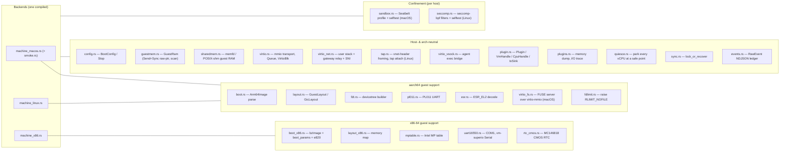
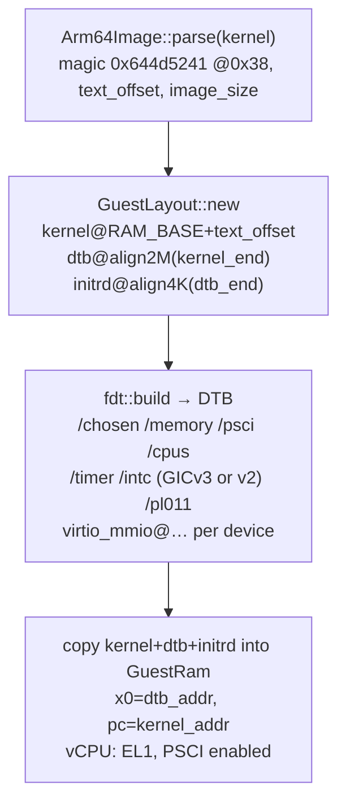
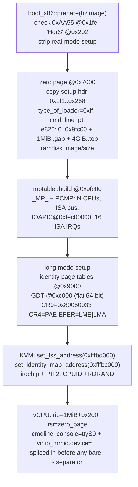
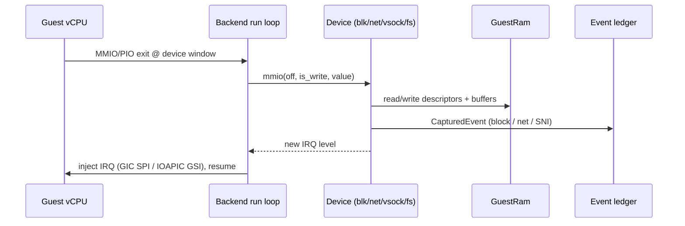

# hvi architecture

`hvi` is a small microVMM for Linux guests, and the substrate brig runs its
sandboxes on. It runs an unmodified Linux kernel under one of three host
backends behind a single CLI, and it is *itself* the virtio backend, so a
sandbox gets the same device model on macOS and on Linux.

This document describes how the pieces fit together. For attaching a tool of
your own, see [`plugins.md`](plugins.md).

---

## 1. Guests, hosts, and backends

hvi separates the **guest architecture** (what kind of kernel it boots) from the
**host backend** (which hypervisor API it drives). Three combinations are built,
selected at compile time by target triple:

| Guest arch | Host | Backend module | Hypervisor API | Live status |
| --- | --- | --- | --- | --- |
| aarch64 | macOS / Apple silicon | `machine_macos.rs` | Hypervisor.framework (`applevisor`) | boots + benchmarked; virtio-fs shares; live in CI |
| aarch64 | Linux | `machine_linux.rs` | KVM (`kvm-ioctls` 0.25) | boots to userspace + SMP + tap; live in CI on vGICv2 and vGICv3 hosts |
| x86-64 | Linux | `machine_x86.rs` | KVM (`kvm-ioctls` 0.25) | boots to userspace + virtio-blk/net + SMP; live in CI on a KVM host |

The design point is that **only the `machine_*` modules differ**. Boot-image
parsing, the guest memory layout, the virtio device models, the event ledger
and the extension seam are all host-neutral. Porting to a new backend means implementing one file: create the
VM, map guest RAM, set up vCPUs, run the exit loop, and hand MMIO/PIO exits to
the shared device dispatch.


### Entry point

Every backend exposes the same signature (`config.rs`):

```rust
pub fn boot(cfg: BootConfig) -> Result<Stop, Box<dyn std::error::Error>>;
```

`main::boot_guest` parses CLI flags into a `BootConfig`, then calls
`hvi::machine::boot(cfg)`. The library root, `lib.rs`, aliases the right
backend to `pub mod machine`, so a crate that links hvi gets the same entry
point the CLI uses:

```rust
#[cfg(all(target_os = "macos", target_arch = "aarch64"))] #[path = "machine_macos.rs"] pub mod machine;
#[cfg(all(target_os = "linux", target_arch = "aarch64"))] #[path = "machine_linux.rs"] pub mod machine;
#[cfg(all(target_os = "linux", target_arch = "x86_64"))]  #[path = "machine_x86.rs"]  pub mod machine;
```

`BootConfig` (`config.rs`) carries the kernel/initramfs bytes, `mem_bytes`,
`cmdline`, device requests (`disk`, `net`, `net_gateway`, `net_tap`, `net_mac`,
`agent_sock`, `fs_shares` with a `ShareMode` and `CachePolicy` each), `vcpus`,
the ledger sink (`events`, `sandbox_id`), the `sandbox` switch, and an
optional `plugin` (§6). `--fs-uid` and `--fs-gid` are not in it: `main` sets
them once for the process through `virtio_fs::set_guest_ids` before the boot,
because every share reads the same pair.
`Stop` is `enum { SystemOff, SystemReset }` — how the guest asked to halt.

On any other host triple the crate builds to a small stub, so the workspace and
its unit tests still compile everywhere. The pure pre-boot pipeline is
exercisable with no hypervisor via `dump-fdt` (aarch64).

---

## 2. Module map



- **Neutral** modules compile and unit-test on every host.
- **aarch64 support** (`boot`, `layout`, `fdt`, `pl011`, `esr`, `fdlimit`) is
  compiled for both the macOS and Linux/arm64 backends and gated off x86.
  `virtio_fs` is gated to macOS.
- **x86-64 support** (`boot_x86`, `layout_x86`, `mptable`, `uart16550`,
  `rtc_cmos`) is used only by `machine_x86`.
- **Confinement** is per host: `sandbox` (Seatbelt) on macOS, `seccomp` on
  Linux. Each carries the selftest the CLI exposes.
- The three `machine_*.rs` files are the only real backend split. `smoke.rs` is a
  macOS-only M0 hvf sanity test (single page, `HVC #0`); `smoke --shm` runs it
  over shared guest RAM.
- `used_ring_litmus.rs` is a `#[cfg(test)]`, `#[ignore]`d concurrency test for
  the used-ring publish; CI runs it weekly on arm64.

Feature bits, device ids, the virtio-mmio register map and the
`virtio_net_hdr_v1` length come from `virtio-bindings` (bindgen output from
the kernel headers), re-exported under hvi's names as `u64` for the MMIO
dispatch. The vsock op codes, packet header and CIDs are hvi's own.

`GuestRam` (`guestmem.rs`) is what makes the device models host-neutral: a
`Send + Sync` accessor over the host's guest-RAM mapping offering
`read*/write*`, a physical `scan()`, `contains()` for a range check, and
`host_ptr`, a bounds-checked raw pointer for the iovec paths (it replaced a
`&mut [u8]` borrow that a guest could alias by pointing two descriptors at one
address). The translation from guest-physical address to host offset is
private; every public accessor goes through it and fails with an `io::Error`
on a range the guest does not own.
Every device reads and writes guest memory only through it. The mapping is
allocated by `sharedmem.rs` from a memfd on Linux or a POSIX shared-memory
object on macOS (mapped with `hv_vm_map` on hvi's own pointer), unlinked from
the namespace once mapped, so an out-of-process tool handed the descriptor
can map the same pages read-only and nothing else can open them by name.

---

## 3. Boot protocols

The two guest architectures use entirely different boot conventions. This is the
largest arch-specific surface.

### 3.1 aarch64 — `Image` + devicetree



`fdt.rs` builds the devicetree the kernel reads at `x0`: PSCI (`method=hvc`) for
power/SMP, the interrupt controller the backend chose (`GicVersion::V3` emits
`arm,gic-v3`, `GicVersion::V2` emits `arm,cortex-a15-gic`, the compatible
QEMU virt advertises for its vGICv2), the ARM generic timer PPIs, the PL011
console (`stdout-path`), and one `virtio_mmio@…` node per backed device. The DTB
length feeds initrd placement, so `main` builds it twice (provisional slot →
settled layout). No firmware, no bootloader — hvi drops the kernel straight into
EL1.

**aarch64 guest memory map** (`layout.rs`):

| Region | Address | IRQ |
| --- | --- | --- |
| RAM base | `0x4000_0000` (1 GiB) | — |
| PL011 UART | `0x0100_0000` (size `0x1000`) | SPI 1 → INTID 33 |
| virtio-blk | `0x0200_0000` (size `0x200`) | SPI 2 → INTID 34 |
| virtio-net | `0x0200_0200` | SPI 3 → INTID 35 |
| virtio-vsock | `0x0200_0400` | SPI 4 → INTID 36 |
| virtio-fs (share `i`) | `0x0200_0600 + i * 0x200` | SPI 5 + `i` → INTID 37 + `i` |
| GIC distributor | `0x0800_0000` (size `0x1_0000`), both versions | — |
| GIC redistributor (v3) or CPU interface (v2) | `0x080A_0000` (one `0x2_0000` frame per vCPU) under `GicLayout::QEMU_VIRT`; `0x0801_0000` (one shared `0x1_0000` window) under `GicLayout::QEMU_VIRT_V2` | — |
| kernel / dtb / initrd | packed up from RAM base | — |

`GicLayout::for_vcpus(version, vcpus)` picks the map. The version is not a
choice: KVM offers the vGIC that matches the host, so a GIC-400 host gets v2
and refuses more than `V2_MAX_CPUS` (8) vCPUs, a GICv3 host gets v3, and the
macOS backend is always v3 because Apple's `hv_gic` is one.

### 3.2 x86-64 — Linux 64-bit boot protocol

There is no devicetree. hvi implements the Linux/x86 boot protocol directly:
parse the `bzImage`, fill a `boot_params` "zero page", build an MP table for
ACPI-less CPU/IOAPIC discovery, and enter the 64-bit kernel in long mode.



Two KVM details are load-bearing on Intel VMX and were the difference between a
triple-fault and a boot: `set_tss_address` + `set_identity_map_address` must be
set even for a long-mode entry, and the vCPU's CPUID must advertise **RDRAND**
(leaf 1 ECX bit 30) or KASLR stalls waiting for entropy.

**x86-64 guest memory map** (`layout_x86.rs`):

| Region | Address |
| --- | --- |
| RAM, low half | `0x0` .. `0xd000_0000` (`MMIO_GAP_START`) |
| RAM, high half (if any) | `0x1_0000_0000` (4 GiB) upwards |
| PML4 / PDPT / PD | `0x9000` / `0xa000` / `0xb000` |
| GDT | `0xc000` |
| boot stack | `0x6ff0` |
| zero page (boot_params) | `0x7000` |
| cmdline | `0x2_0000` |
| MP table | `0x9_fc00` (EBDA) |
| kernel load / 64-bit entry | `0x10_0000` (1 MiB) / `0x10_0200` |
| COM1 UART | PIO `0x3f8` (GSI 4) |
| CMOS RTC | PIO `0x70` / `0x71` |
| virtio-blk / net / vsock | `0xd000_0000` / `0xd000_0200` / `0xd000_0400` (GSIs 5 / 6 / 7) |
| LAPIC / IOAPIC | `0xfee0_0000` / `0xfec0_0000` |

The CMOS RTC is not an optional device. `read_persistent_clock64()` polls its
update-in-progress bit with interrupts disabled, and an unimplemented port reads
back `0xff`, so that bit never clears: a guest without it spins there forever,
before the console is up.

Guest RAM is not one contiguous span from zero. Two fixed things live under
4 GiB and RAM laid over either one breaks, in different ways: RAM over the
virtio-mmio window shadows the device registers, so KVM services the access
from memory and never exits to us and the devices silently stop responding;
RAM over the in-kernel LAPIC page makes KVM refuse the memory region outright
with `EEXIST`. So RAM stops at the device window, which is the lower of the
two, and the remainder resumes at 4 GiB as a second KVM slot into the same
memfd. The host mapping stays contiguous; only the guest-physical view has a
gap.

---

## 4. Device model

hvi speaks **virtio-mmio** on every backend (x86 too — Linux drives virtio-mmio
via `virtio_mmio.device=<size>@<addr>:<irq>` on the cmdline), which avoids a PCI
host bridge and lets one set of device models serve all three backends.

The exit loop is the same shape everywhere: run the vCPU, and on a memory exit
into a device window, hand the access to the device and, if the device's IRQ
line changed, inject it.



Interrupt injection is the one device-facing thing that differs by backend:

- **macOS/arm64:** `gic_set_spi(INTID, level)` on the in-kernel GICv3.
- **Linux/arm64:** `vm.set_irq_line(spi_gsi(SPI), level)`, `spi_gsi(spi) = SPI_type | (32 + spi)`, the same call for vGICv2 and vGICv3.
- **x86:** `vm.set_irq_line(GSI, level)` on the in-kernel IOAPIC (GSIs 4–7).

### Devices

- **virtio-blk** (`virtio.rs`, device id 2) — backs `--disk`; advertises
  `VIRTIO_BLK_F_FLUSH` and honours flush with a real `sync_data()`. Every
  request emits a `block` boundary event (LBA, length, r/w).
- **virtio-net** (`virtio_net.rs`, device id 1) — three modes:
  - *Built-in user-space stack* (`--net`): no `vmnet`, no entitlement. Answers
    ARP/ICMP/DHCP (guest `10.0.2.15`, gw `10.0.2.2`, DNS `10.0.2.3`) and resolves
    DNS through the host, capturing the queried name. A DNS question that ends
    before its type and class is refused.
  - *Gateway relay* (`--net-gateway <sock>`): `VirtioNet::with_gateway` connects
    a Unix socket to an external gvisor-tap process and relays frames with a
    4-byte big-endian length prefix (QEMU stream protocol); the gateway's own
    DHCP/DNS/NAT give the guest `10.87.0.2` with `10.87.0.1` as gateway and
    DNS. A `spawn_net_gateway_reader` thread pumps gateway→guest frames and
    raises the net IRQ. An unreachable socket logs a warning and falls back to
    the built-in stack.
  - *Tap* (`--net-tap <dev>`, Linux only): attaches to an existing tap with
    `IFF_VNET_HDR` and no offloads (`tap.rs`), so each frame carries an
    all-zero `virtio_net_hdr_v1`. The tap is created and bridged by whoever
    owns the network namespace (urunc, in brig's case); hvi only opens it. A
    tap that cannot be opened fails the boot and names the interface. macOS
    refuses the flag. `--net-mac` sets the guest MAC in this mode only: the
    tap branch of `machine_linux.rs` and `machine_x86.rs` is the one place
    that reads `BootConfig::net_mac`, because the redirect hands hvi the
    veth's frames unchanged and the guest has to answer to the veth's MAC.
    The built-in stack, the gateway relay and `machine_macos.rs` ignore it.
  - Either way, `observe_tx` parses **TLS SNI** out of the ClientHello and
    every flow emits a `net` boundary event (five-tuple, direction, bytes, SNI/DNS).
    The frame a transmit chain may assemble is bounded.
- **virtio-vsock** (`virtio_vsock.rs`, device id 19) — the exec channel. With
  `--agent-sock`, `spawn_vsock_bridge` stands up a host `UnixListener`; each
  accept opens a vsock stream to the guest agent (host CID 2, guest CID 3, port
  1024), relaying bytes both ways and raising the vsock IRQ.
- **virtio-fs** (`virtio_fs.rs`, device id 26, macOS arm64) — one device per
  repeated `--share-ro <path> <tag>` or `--share-rw <path> <tag>`, at
  `virtio_fs_base(i)` / `virtio_fs_spi(i)`. hvi answers the guest's FUSE
  messages directly over a hiprio and a request virtqueue; no macFUSE mount,
  block image, DAX window or indirect descriptors. Lookup, attributes, links,
  directory traversal, reads, `READLINK`, `ACCESS`, `STATFS`, `STATX` and
  `FORGET`/`BATCH_FORGET` are served on every share; real host file handles
  keep open files valid across rename/unlink. Writable exports add create,
  write, truncate, metadata and xattr updates, OFD locks, allocation,
  seek/copy_file_range, directory handles/readdirplus, atomic rename variants,
  tmpfiles, FIFOs, Unix sockets (held in the device, never on the host),
  removal and sync; read-only exports return `EROFS` for mutations.
  - *Resolution by descriptor.* Every host operation is relative to the
    parent directory's descriptor with `O_NOFOLLOW` on each component
    (`openat`, `fstatat`, `mkdirat`, `symlinkat`, `unlinkat`, `linkat`,
    `renameat`/`renameatx_np`, `readlinkat`, `faccessat`, `fstatvfs`,
    `fsetxattr`/`fgetxattr` on an `O_SYMLINK` descriptor for a link's own
    attributes). Containment follows from how the descriptor was obtained;
    no path string is resolved host-side afterwards, and clippy's
    `disallowed-methods` refuses `canonicalize` in the device. A symlink
    stored in a share is resolved the guest's way: an absolute target restarts
    at the export root, a relative one continues from where it was found, a
    climbing target is clamped at the root, and a cycle ends as `ELOOP`.
    Descriptors are cached per relative path (LRU, root pinned); removals and
    renames invalidate the path and everything beneath it; `cache=none`
    bypasses the cache.
  - *Cache policy.* Per share, `cache=auto|always|none`. `auto` (default)
    advertises a one-second attribute and entry timeout and keeps the page
    cache across opens, with `FUSE_AUTO_INVAL_DATA`; `none` advertises zero
    timeouts; `always` adds the writeback cache. `FUSE_PARALLEL_DIROPS` is
    negotiated.
  - *Ownership.* Linux mode, uid, gid and device numbers live in a private
    host xattr under `com.nofire.hvi.`, cached per node and dropped when a new
    path resolves to an already-known inode (inode reuse or a new hard link).
    The host inode keeps owner access for the VMM. `--fs-uid`/`--fs-gid`
    (default 0) map the host user to a guest identity in both directions.
  - *Dispatch.* Each device has a worker thread. `mmio` records the notified
    queue in a bitmask; the vCPU drains up to an inline budget of chains in
    the exit and wakes the worker for the rest, which raises the SPI once per
    pass under the device mutex and kicks the vCPUs. `READ` and `WRITE` use
    `preadv`/`pwritev` over iovecs built from `GuestRam::host_ptr` when the
    declared size matches the descriptors; otherwise the buffered handler
    re-validates. `notified` and the zero-copy counters are atomics.
  - *Host resources.* `fdlimit` raises the soft `RLIMIT_NOFILE` to the hard
    limit at startup. An export refuses `OPEN` past its budget (the process
    limit less a reserve of 128) with `ENFILE`, and reports its peak handle
    count on a clean stop. A node holds at most sixteen alias paths. Host
    errnos are named to the guest instead of collapsing to `EIO`. `OPEN`
    refuses anything but a regular file, because opening a FIFO under the
    device mutex blocked the VM.
  - *Confinement.* Seatbelt independently grants `file-read*` or
    `file-read* file-write*` only below each exported subtree, by the resolved
    root path.

The serial console is a **PL011** (`pl011.rs`, MMIO) on arm64 and a **16550**
(`uart16550.rs`, PIO `0x3f8`) on x86. The x86 one wraps `vm-superio`'s
`Serial`, which is edge-triggered; hvi drives COM1 as a level line, so the
wrapper computes the level from the interrupt conditions (received data
enabled and a byte waiting, or THR-empty enabled), not from the IIR, which
`vm-superio` clears on read. The guest now detects a `U6_16550A` with a FIFO
where the hand-rolled device presented a `16450`.

### Used-ring ordering

`Queue::push_used` writes the used element and then the index. Completions
happen on worker threads (virtio-fs, virtio-net delivery, vsock RX) while the
guest runs on another core, so the publish carries a release fence per drain
pass: free on x86, `dmb` on arm64. Without it an arm64 guest observed the
bumped index before the element and broke its virtqueue ("id 65 is not a
head!"). `used_ring_litmus.rs` drives the real `push_used` against a consumer
that behaves like the driver; it demonstrates the defect and the fix but does
not reliably catch a regression, so it is `#[ignore]`d and run weekly.

Every descriptor-chain walker (`handle_chain`, `read_tx_frame`, `read_tx`)
refuses an index outside the ring and caps the walk at the ring size, so a
cycle runs out of budget. Re-programming any queue register clears `ready`.

### Confinement

The VMM confines itself before it services guest I/O: a Seatbelt profile on
macOS (`sandbox.rs`), two seccomp-bpf allowlists on Linux (`seccomp.rs`,
`resources/seccomp/{x86_64,aarch64}.json` in seccompiler's schema, `vcpu` and
`vmm` per thread). Both are on by default, `--no-sandbox` turns them off, and
`HVI_SECCOMP=log` on Linux records mismatches instead of trapping. Each has a
selftest subcommand that installs the shipped profile or filters and probes
both directions; CI runs them on the hosted runners.

### Failure handling (macOS backend)

Every path that ends the run loop calls `stop_all`, which also releases the
quiesce so no vCPU stays parked. The vCPU loop runs under `catch_unwind`; a
panic reports the vCPU, its last exit reason (from a thread-local written once
per exit) and its program counter, then stops the VM. Device and ledger
mutexes go through `sync::lock_or_recover`, which takes a poisoned lock: the
panic that poisoned it is reported where it happened, once. The Linux and x86
backends still use `.lock().unwrap()`.

---

## 5. Event ledger

What the VMM sees at its own device models lands in one NDJSON stream
(`events.rs`), one compact JSON object per line, whose shape is pinned by
tests:

```json
{"sandbox_id":"hvi","ts":…,"provenance":"boundary","source":"block","payload":{"lba":2048,"len":4096,"rw":"w"}}
{"sandbox_id":"hvi","ts":…,"provenance":"boundary","source":"net","payload":{"five_tuple":{…},"direction":"egress","guest_initiated":true,"bytes":72,"sni":"example.com"}}
```

`--events <path>` sinks the ledger, and the ledger is drained on a cadence, not
only at exit. Because hvi *is* the virtio backend, these are observed, not
reported: the guest cannot decline to be seen at a device it has to use, and
nothing in the guest has to cooperate.

---

## 6. The extension seam

A VMM holds the guest's memory, can park its vCPUs between guest entries, and is
the other end of every virtio request. Debuggers, tracers, profilers and
crash-dumpers want one or more of those, and none of them belongs in the exit
loop — so the exit loop offers them instead, in `plugin.rs`.

| Trait | When | What it offers |
| --- | --- | --- |
| `Plugin` | — | `attach` (once, pre-boot), `safepoint` (on cpu0, between guest entries), `request` (the console's interrupt key) |
| `VmHandle` | at `attach` | guest RAM, its descriptor and regions, the ledger, device presence, sink installation, `kick` |
| `CpuHandle` | at `safepoint` | this vCPU's `RegsView`, guest RAM, the ledger, and `pause`/`resume` for the rest of the VM |
| `IoSink` | per request | each virtio-blk request and virtio-net frame as it crosses the device |

`plugins.rs` ships two built on it — a guest-memory dumper and an I/O tracer —
and `BootConfig::plugin` is how a caller supplies its own. The whole seam is
optional: with no plugin the hooks are one null check on a cold path, the
devices hold no sink, and no guest memory is read for any purpose but running
the guest.

The traits hand over *access* and deliberately no more. `RegsView::root` is the
architectural translation-base register (TTBR1_EL1 or CR3), not an
interpretation of it; what any of it means is the tool's problem. That is what
keeps a tool's idea of the guest out of the VMM, and it is why a tool can live
in another crate entirely.

### 6.1 Why `safepoint` is where it is

Only the vCPU thread can read its own registers, so the hook is on cpu0 between
guest entries, at the same point every other vCPU parks for a quiesce.
`CpuHandle::pause()` parks the others and returns `true` once they are all there;
the caller then owes exactly one `resume()`. On failure the quiesce is released
before `false` comes back, so a failed pause cannot leave the VM stopped.

A tool that wakes on its own schedule — a timer, a socket — sets its flag and
then calls `VmHandle::kick()`. Without the kick an idle guest sits in WFI/HLT and
never reaches the hook, so the request waits for the next unrelated exit, or on
x86 never lands at all.

---

## 7. Build & test matrix

| What | Where | Notes |
| --- | --- | --- |
| Portable core (fmt/reflow/clippy/rustdoc/unit tests) | `ubuntu-latest` | reflow on the nightly pinned in `pins.env` |
| Workflow lint, dependency audit | `ubuntu-latest` | actionlint + shellcheck; `cargo deny check` |
| seccomp selftest | `ubuntu-latest` | x86-64 filters, no KVM needed |
| Linux/arm64 backend | `ubuntu-latest` (cross clippy + rustdoc) | unit tests of the arm64-Linux modules run nowhere |
| macOS/hvf backend | `macos-15` | build, test, ad-hoc sign, Seatbelt selftest |
| x86 live boot (+ SMP) | self-hosted x86 runner with `/dev/kvm` | userspace/VFS gate, 2 vCPUs online; skips with a warning without KVM |
| arm64/hvf live boot | self-hosted Apple silicon | `smoke`, `smoke --shm`, boot to userspace |
| arm64/KVM live boot | self-hosted arm64, vGICv2 (`nbfc`) and vGICv3 (`gicv3`) | aarch64 seccomp selftest, boot, tap boot when a tap can be created, unusable-tap refusal |
| virtio-fs perf gate | self-hosted Apple silicon, same-repo PRs | `tools/perf-gate.sh`: host ops equal, time within 1.5x of the merge base |
| Scheduled | `ubuntu-latest`, self-hosted arm64 | weekly `cargo deny`, weekly used-ring litmus, monthly reflow-nightly drift; each files a tracking issue |

The self-hosted lanes are withheld from pull requests opened from a fork. No
GitHub-hosted arm64 runner exposes `/dev/kvm`, and a live macOS boot needs the
entitlement on an interactive host, so the live boots run on runners the
project owns. Every job has a `timeout-minutes` cap and the boot jobs upload
logs and the ledger on failure.
