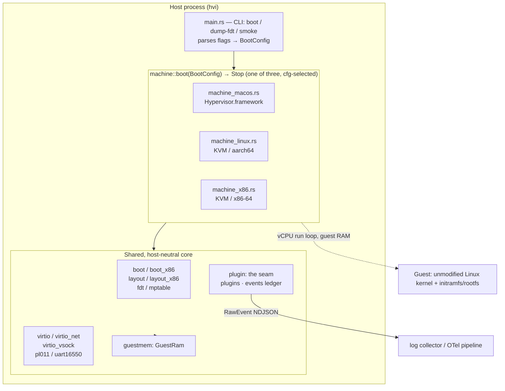
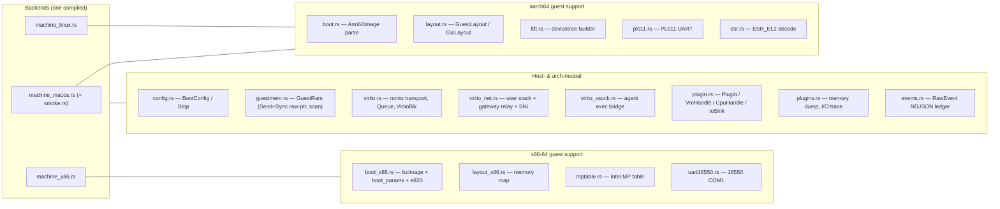
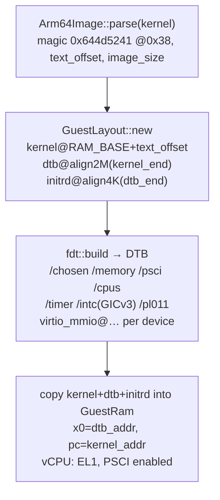
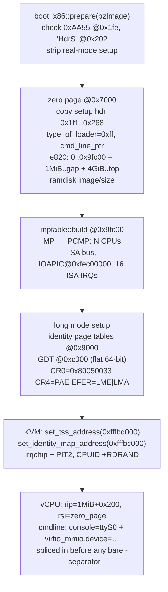
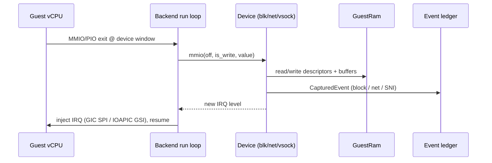

# hvi architecture

`hvi` is a small, observable microVMM for Linux guests. It runs an unmodified
Linux kernel under one of three host backends behind a single CLI, and — since
it is *itself* the virtio backend — captures every disk and network boundary
event with no guest cooperation, including DNS names and TLS SNI. Everything is
emitted as `RawEvent` NDJSON
so a guest on macOS produces the same telemetry stream as one on Linux/KVM.

This document describes how the pieces fit together. For attaching a tool of
your own, see [`plugins.md`](plugins.md).

---

## 1. Guests, hosts, and backends

hvi separates the **guest architecture** (what kind of kernel it boots) from the
**host backend** (which hypervisor API it drives). Three combinations are built,
selected at compile time by target triple:

| Guest arch | Host | Backend module | Hypervisor API | Live status |
| --- | --- | --- | --- | --- |
| aarch64 | macOS / Apple silicon | `machine_macos.rs` | Hypervisor.framework (`applevisor`) | boots + benchmarked |
| aarch64 | Linux | `machine_linux.rs` | KVM (`kvm-ioctls`) | boots to userspace + SMP |
| x86-64 | Linux | `machine_x86.rs` | KVM (`kvm-ioctls`) | boots to userspace + virtio-blk/net + SMP |

The design point is that **only the `machine_*` modules differ**. Boot-image
parsing, the guest memory layout, the virtio device models, the event ledger
and the extension seam are all host-neutral. Porting to a new backend means implementing one file: create the
VM, map guest RAM, set up vCPUs, run the exit loop, and hand MMIO/PIO exits to
the shared device dispatch.



### Entry point

Every backend exposes the same signature (`config.rs`):

```rust
pub fn boot(cfg: BootConfig) -> Result<Stop, Box<dyn std::error::Error>>;
```

`main::boot_guest` parses CLI flags into a `BootConfig`, then calls
`machine::boot(cfg)`. `main.rs` aliases the right backend to `mod machine`:

```rust
#[cfg(all(target_os = "macos", target_arch = "aarch64"))] #[path = "machine_macos.rs"] mod machine;
#[cfg(all(target_os = "linux", target_arch = "aarch64"))] #[path = "machine_linux.rs"] mod machine;
#[cfg(all(target_os = "linux", target_arch = "x86_64"))]  #[path = "machine_x86.rs"]  mod machine;
```

`BootConfig` (`config.rs`) carries the kernel/initramfs bytes, `mem_bytes`,
`cmdline`, device requests (`disk`, `net`, `net_gateway`, `agent_sock`),
`vcpus`, the ledger sink (`events`, `sandbox_id`), and an optional `plugin`
(§6).
`Stop` is `enum { SystemOff, SystemReset }` — how the guest asked to halt.

On any other host triple the crate builds to a small stub, so the workspace and
its unit tests still compile everywhere. The pure pre-boot pipeline is
exercisable with no hypervisor via `dump-fdt` (aarch64).

---

## 2. Module map



- **Neutral** modules compile and unit-test on every host.
- **aarch64 support** (`boot`, `layout`, `fdt`, `pl011`, `esr`) is used by both
  the macOS and Linux/arm64 backends; it is inert (dead code) on x86.
- **x86-64 support** (`boot_x86`, `layout_x86`, `mptable`, `uart16550`) is used
  only by `machine_x86`.
- The three `machine_*.rs` files are the only real backend split. `smoke.rs` is a
  macOS-only M0 hvf sanity test (single page, `HVC #0`).

`GuestRam` (`guestmem.rs`) is what makes the device models host-neutral: a
`Send + Sync` accessor over the host's guest-RAM mapping (the `applevisor`
allocation on macOS, the `mmap` region registered with KVM on Linux) offering
`read*/write*`, a physical `scan()`, and bounds-checked `offset()`. Every device
reads and writes guest memory only through it.

---

## 3. Boot protocols

The two guest architectures use entirely different boot conventions. This is the
largest arch-specific surface.

### 3.1 aarch64 — `Image` + devicetree



`fdt.rs` builds the devicetree the kernel reads at `x0`: PSCI (`method=hvc`) for
power/SMP, a GICv3 interrupt controller, the ARM generic timer PPIs, the PL011
console (`stdout-path`), and one `virtio_mmio@…` node per backed device. The DTB
length feeds initrd placement, so `main` builds it twice (provisional slot →
settled layout). No firmware, no bootloader — hvi drops the kernel straight into
EL1.

**aarch64 guest memory map** (`layout.rs`):

| Region | Address | IRQ |
| --- | --- | --- |
| RAM base | `0x4000_0000` (1 GiB) | — |
| PL011 UART | `0x0100_0000` (size `0x1000`) | SPI 1 → INTID 33 |
| virtio-blk | `0x0200_0000` (size `0x200`) | SPI 2 → INTID 34 |
| virtio-net | `0x0200_0200` | SPI 3 → INTID 35 |
| virtio-vsock | `0x0200_0400` | SPI 4 → INTID 36 |
| virtio-fs | `0x0200_0600` | SPI 5 → INTID 37 |
| GIC distributor | `0x0800_0000` (size `0x1_0000`) | — |
| GIC redistributor | `0x080A_0000` (per-vCPU frame) | — |
| kernel / dtb / initrd | packed up from RAM base | — |

### 3.2 x86-64 — Linux 64-bit boot protocol

There is no devicetree. hvi implements the Linux/x86 boot protocol directly:
parse the `bzImage`, fill a `boot_params` "zero page", build an MP table for
ACPI-less CPU/IOAPIC discovery, and enter the 64-bit kernel in long mode.



Two KVM details are load-bearing on Intel VMX and were the difference between a
triple-fault and a boot: `set_tss_address` + `set_identity_map_address` must be
set even for a long-mode entry, and the vCPU's CPUID must advertise **RDRAND**
(leaf 1 ECX bit 30) or KASLR stalls waiting for entropy.

**x86-64 guest memory map** (`layout_x86.rs`):

| Region | Address |
| --- | --- |
| RAM, low half | `0x0` .. `0xd000_0000` (`MMIO_GAP_START`) |
| RAM, high half (if any) | `0x1_0000_0000` (4 GiB) upwards |
| PML4 / PDPT / PD | `0x9000` / `0xa000` / `0xb000` |
| GDT | `0xc000` |
| boot stack | `0x6ff0` |
| zero page (boot_params) | `0x7000` |
| cmdline | `0x2_0000` |
| MP table | `0x9_fc00` (EBDA) |
| kernel load / 64-bit entry | `0x10_0000` (1 MiB) / `0x10_0200` |
| COM1 UART | PIO `0x3f8` (GSI 4) |
| CMOS RTC | PIO `0x70` / `0x71` |
| virtio-blk / net / vsock | `0xd000_0000` / `0xd000_0200` / `0xd000_0400` (GSIs 5 / 6 / 7) |
| LAPIC / IOAPIC | `0xfee0_0000` / `0xfec0_0000` |

The CMOS RTC is not an optional device. `read_persistent_clock64()` polls its
update-in-progress bit with interrupts disabled, and an unimplemented port reads
back `0xff`, so that bit never clears: a guest without it spins there forever,
before the console is up.

Guest RAM is not one contiguous span from zero. Two fixed things live under
4 GiB and RAM laid over either one breaks, in different ways: RAM over the
virtio-mmio window shadows the device registers, so KVM services the access
from memory and never exits to us and the devices silently stop responding;
RAM over the in-kernel LAPIC page makes KVM refuse the memory region outright
with `EEXIST`. So RAM stops at the device window, which is the lower of the
two, and the remainder resumes at 4 GiB as a second KVM slot into the same
memfd. The host mapping stays contiguous; only the guest-physical view has a
gap.

---

## 4. Device model

hvi speaks **virtio-mmio** on every backend (x86 too — Linux drives virtio-mmio
via `virtio_mmio.device=<size>@<addr>:<irq>` on the cmdline), which avoids a PCI
host bridge and lets one set of device models serve all three backends.

The exit loop is the same shape everywhere: run the vCPU, and on a memory exit
into a device window, hand the access to the device and, if the device's IRQ
line changed, inject it.



Interrupt injection is the one device-facing thing that differs by backend:

- **macOS/arm64:** `gic_set_spi(INTID, level)` on the in-kernel GICv3.
- **Linux/arm64:** `vm.set_irq_line(spi_gsi(SPI), level)`, `spi_gsi(spi) = SPI_type | (32 + spi)`.
- **x86:** `vm.set_irq_line(GSI, level)` on the in-kernel IOAPIC (GSIs 4–7).

### Devices

- **virtio-blk** (`virtio.rs`, device id 2) — backs `--disk`; advertises
  `VIRTIO_BLK_F_FLUSH` and honours flush with a real `sync_data()`. Every
  request emits a `block` boundary event (LBA, length, r/w).
- **virtio-net** (`virtio_net.rs`, device id 1) — two modes:
  - *Built-in user-space stack* (`--net`): no `vmnet`, no entitlement. Answers
    ARP/ICMP/DHCP (guest `10.0.2.15`, gw `10.0.2.2`, DNS `10.0.2.3`) and resolves
    DNS through the host, capturing the queried name.
  - *Gateway relay* (`--net-gateway <sock>`): `VirtioNet::with_gateway` connects
    a Unix socket to an external gvisor-tap process and relays frames with a
    4-byte big-endian length prefix (QEMU stream protocol). A
    `spawn_net_gateway_reader` thread pumps gateway→guest frames and raises the
    net IRQ.
  - Either way, `observe_tx` parses **TLS SNI** out of the ClientHello and
    every flow emits a `net` boundary event (five-tuple, direction, bytes, SNI/DNS).
- **virtio-vsock** (`virtio_vsock.rs`, device id 19) — the exec channel. With
  `--agent-sock`, `spawn_vsock_bridge` stands up a host `UnixListener`; each
  accept opens a vsock stream to the guest agent (host CID 2, guest CID 3, port
  1024), relaying bytes both ways and raising the vsock IRQ.
- **virtio-fs** (`virtio_fs.rs`, device id 26, macOS arm64) — exports one
  canonical host directory per repeated `--share-ro <path> <tag>` or
  `--share-rw <path> <tag>`. HVI answers
  the guest's FUSE messages directly over hiprio + request virtqueues; no macFUSE
  mount, block image, or DAX window is involved. Lookup, attributes, links,
  directory traversal and reads are supported, and real host file handles keep
  open files valid across rename/unlink. Writable exports add create, write,
  truncate, metadata and xattr updates, locks, allocation, seek/copy, directory
  handles/readdirplus, atomic rename variants, tmpfiles, removal and sync;
  read-only exports return `EROFS` for mutations. Writable exports advertise
  zero cache timeouts for coherence with concurrent host edits. Guest root is
  mapped to the macOS uid/gid running HVI. Seatbelt independently grants
  `file-read*` or `file-read* file-write*` only below each exported subtree.

The serial console is a **PL011** (`pl011.rs`, MMIO) on arm64 and a **16550**
(`uart16550.rs`, PIO `0x3f8`) on x86.

---

## 5. Event ledger

What the VMM sees at its own device models lands in one NDJSON stream
(`events.rs`), one compact JSON object per line, whose shape is pinned by
tests:

```json
{"sandbox_id":"hvi","ts":…,"provenance":"boundary","source":"block","payload":{"lba":2048,"len":4096,"rw":"w"}}
{"sandbox_id":"hvi","ts":…,"provenance":"boundary","source":"net","payload":{"five_tuple":{…},"direction":"egress","guest_initiated":true,"bytes":72,"sni":"example.com"}}
```

`--events <path>` sinks the ledger. Because hvi *is* the virtio backend, these
are observed rather than reported: the guest cannot decline to be seen at a
device it has to use, and nothing in the guest has to cooperate.

---

## 6. The extension seam

A VMM holds the guest's memory, can park its vCPUs between guest entries, and is
the other end of every virtio request. Debuggers, tracers, profilers and
crash-dumpers want one or more of those, and none of them belongs in the exit
loop — so the exit loop offers them instead, in `plugin.rs`.

| Trait | When | What it offers |
| --- | --- | --- |
| `Plugin` | — | `attach` (once, pre-boot), `safepoint` (on cpu0, between guest entries), `request` (the console's interrupt key) |
| `VmHandle` | at `attach` | guest RAM, its descriptor and regions, the ledger, device presence, sink installation, `kick` |
| `CpuHandle` | at `safepoint` | this vCPU's `RegsView`, guest RAM, the ledger, and `pause`/`resume` for the rest of the VM |
| `IoSink` | per request | each virtio-blk request and virtio-net frame as it crosses the device |

`plugins.rs` ships two built on it — a guest-memory dumper and an I/O tracer —
and `BootConfig::plugin` is how a caller supplies its own. The whole seam is
optional: with no plugin the hooks are one null check on a cold path, the
devices hold no sink, and no guest memory is read for any purpose but running
the guest.

The traits hand over *access* and deliberately no more. `RegsView::root` is the
architectural translation-base register (TTBR1_EL1 or CR3), not an
interpretation of it; what any of it means is the tool's problem. That is what
keeps a tool's idea of the guest out of the VMM, and it is why a tool can live
in another crate entirely.

### 6.1 Why `safepoint` is where it is

Only the vCPU thread can read its own registers, so the hook is on cpu0 between
guest entries, at the same point every other vCPU parks for a quiesce.
`CpuHandle::pause()` parks the others and returns `true` once they are all there;
the caller then owes exactly one `resume()`. On failure the quiesce is released
before `false` comes back, so a failed pause cannot leave the VM stopped.

A tool that wakes on its own schedule — a timer, a socket — sets its flag and
then calls `VmHandle::kick()`. Without the kick an idle guest sits in WFI/HLT and
never reaches the hook, so the request waits for the next unrelated exit, or on
x86 never lands at all.

---

## 7. Build & test matrix

| What | Where | Notes |
| --- | --- | --- |
| Portable core (fmt/clippy/unit tests) | `ubuntu-latest` | backend-agnostic modules; runs anywhere |
| Linux/arm64 backend | `ubuntu-latest` (cross `cargo check` + clippy) | no arm64 runner; live boot needs an arm64/KVM host |
| macOS/hvf backend | `macos-15` | builds + tests + ad-hoc signs (needs macOS 15 `hv_gic_*`) |
| x86 live boot (+ SMP) | `ubuntu-latest` (`/dev/kvm`) | boots to the userspace/VFS gate, asserts 2 vCPUs online |
| arm64 live boot | self-hosted arm64 runners | boots to userspace on hvf and on KVM |

The GitHub-hosted x86 `ubuntu-latest` runners expose `/dev/kvm` (nested virt), so
the x86 live boot actually runs in CI. GitHub-hosted arm64 runners do **not**
expose KVM, so both arm64 backends are compile-checked in CI and boot-tested on
self-hosted runners.
