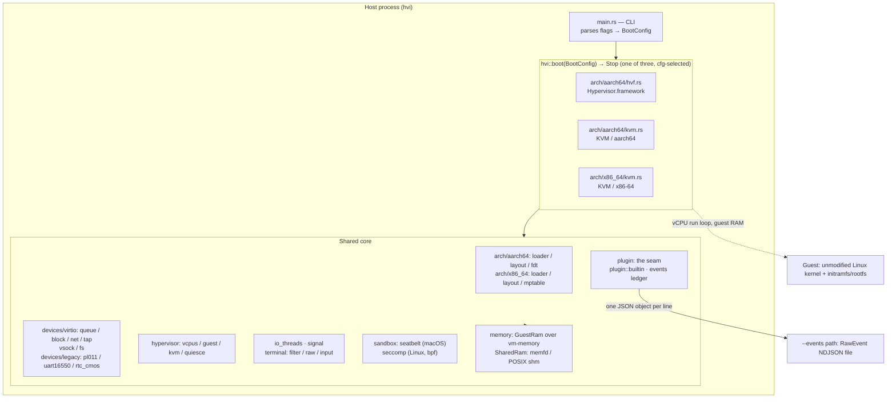
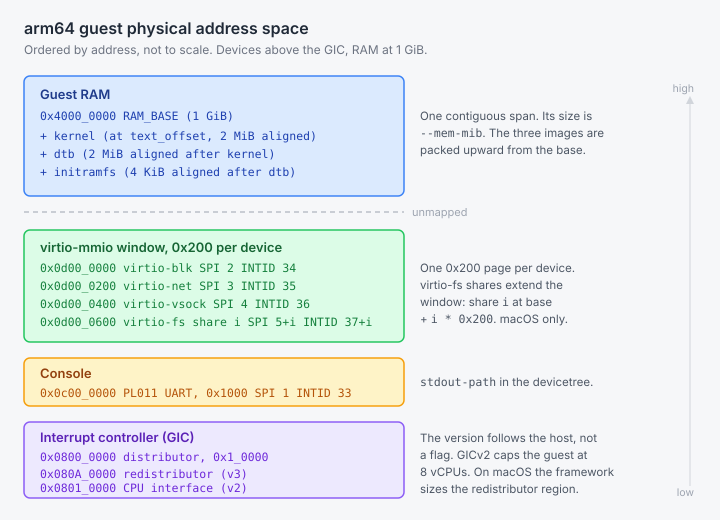
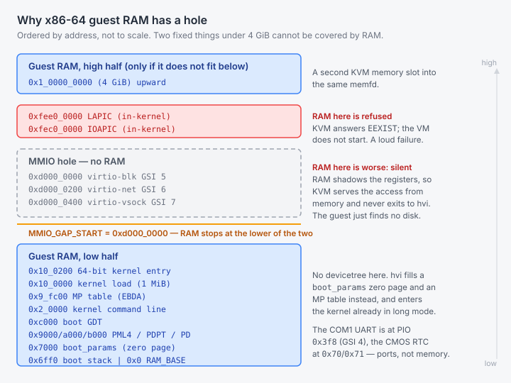
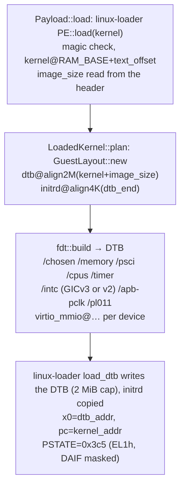
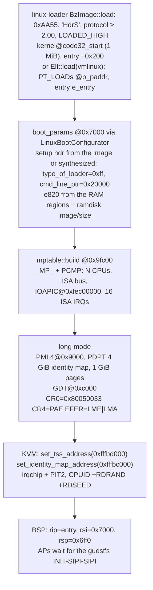
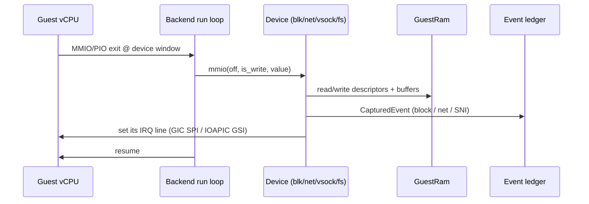

# Architecture

hvi runs an unmodified Linux kernel under one of three host backends behind a
single entry point, and it is itself the virtio backend, so a guest gets the
same device model wherever it runs.

This page describes the design. For attaching a tool, read
[plugins.md](plugins.md). For linking the library, read
[embedding.md](embedding.md).

## 1. Guests, hosts and backends

hvi separates the **guest architecture**, which decides the boot protocol,
from the **host backend**, which decides the hypervisor API. Three
combinations are built, selected at compile time by target triple.

| Guest | Host | Backend module | Hypervisor API |
| --- | --- | --- | --- |
| aarch64 | macOS, Apple silicon | `arch/aarch64/hvf.rs` | Hypervisor.framework (`applevisor`) |
| aarch64 | Linux | `arch/aarch64/kvm.rs` | KVM (`kvm-ioctls` 0.25) |
| x86-64 | Linux | `arch/x86_64/kvm.rs` | KVM (`kvm-ioctls` 0.25) |

Two kinds of difference cut across those three, and conflating them is the
usual mistake:

- **Host differences** live in the backend modules, and in `hypervisor/kvm.rs`
  for what the two KVM backends share: creating the VM, mapping guest RAM,
  entering the guest and serving its exits, and how a kick and an interrupt
  line reach the guest. Confinement is a host difference too, and lives in
  `sandbox/`.
- **Guest-architecture differences** live in the loader and layout modules
  under `arch/<arch>/`, and they are larger. An arm64 guest gets an `Image`, a
  devicetree and PSCI. An x86-64 guest gets a `bzImage` or an uncompressed
  `vmlinux` with a `boot_params` page, an e820 map and an MP table. Some devices
  are architecture-specific too: PL011 against 16550, and a CMOS RTC that only
  x86 needs.

Porting to a new host backend means a new `arch/<arch>/<hypervisor>.rs` file
with a `Kick` and an `IrqLine` implementation and a `Guest` built from them, its
`mod` line in `arch/<arch>/mod.rs`, its `pub use` of `boot` and its target in
the build guard, both in `lib.rs`, and its dependencies in `Cargo.toml`. Porting
to a new guest architecture is a much larger job.

On any other target the build stops with a compile error.


```mermaid
flowchart TB
    subgraph host["Host process (hvi)"]
        cli["main.rs — CLI<br/>parses flags → BootConfig"]
        subgraph backend["hvi::boot(BootConfig) → Stop  (one of three, cfg-selected)"]
            direction LR
            m1["arch/aarch64/hvf.rs<br/>Hypervisor.framework"]
            m2["arch/aarch64/kvm.rs<br/>KVM / aarch64"]
            m3["arch/x86_64/kvm.rs<br/>KVM / x86-64"]
        end
        subgraph shared["Shared core"]
            direction LR
            arch_["arch/aarch64: loader / layout / fdt<br/>arch/x86_64: loader / layout / mptable"]
            dev["devices/virtio: queue / block / net / tap<br/>vsock / fs<br/>devices/legacy: pl011 / uart16550 / rtc_cmos"]
            obs["plugin: the seam<br/>plugin::builtin · events ledger"]
            vm["hypervisor: vcpus / guest / kvm / quiesce"]
            rt["io_threads · signal<br/>terminal: filter / raw / input"]
            conf["sandbox: seatbelt (macOS)<br/>seccomp (Linux, bpf)"]
            gm["memory: GuestRam over vm-memory<br/>SharedRam: memfd / POSIX shm"]
        end
        cli --> backend
        backend --> shared
        shared --> gm
    end
    guest["Guest: unmodified Linux kernel + initramfs/rootfs"]
    ledger["--events path: RawEvent NDJSON file"]
    backend -. "vCPU run loop, guest RAM" .-> guest
    obs -- "one JSON object per line" --> ledger
```

### The entry point

Every backend exposes the same signature:

```rust
pub fn boot(cfg: BootConfig) -> Result<Stop, Box<dyn std::error::Error>>;
```

The crate root re-exports the one for the host target as `hvi::boot`, so the CLI
and a linking crate use the same call. `Stop` is `SystemOff` or `SystemReset`.

`SystemReset` stops the process. hvi never reboots a guest.

Two settings a caller supplies are not in `BootConfig`: the guest file ownership
(`devices::virtio::fs::set_guest_ids`, process-global) and the `HVI_*`
environment variables. See
[embedding.md](embedding.md#configuration-outside-bootconfig).

## 2. Guest memory

`GuestRam` (`memory/guest.rs`) is what makes the device models host-neutral: a
wrapper over a `vm-memory` `GuestMemoryMmap` whose regions are the guest's RAM.
Every device reads and writes guest memory only through it, and `memory()`
returns the collection for the rust-vmm crates that take guest memory. Its read
accessors live on `GuestRamView`, which it dereferences to; a tool that only
reads builds a `GuestRamView` of its own over the RAM descriptor, with
`PROT_READ` pages and no write accessor.

Every accessor that takes a guest address resolves it through the view's table
of the collection's regions and fails with an `io::Error` on a range the guest
does not own. A range that would cross from one region into the next is refused.
`scan()` takes no guest address: it walks each region's host mapping and maps
its hits back to guest addresses.

`host_ptr` is a bounds-checked raw pointer into one region for the iovec
paths. It is a raw pointer rather than a `&mut [u8]` because a guest can point
two descriptors at one address, which would alias the borrow.

The backing object comes from `memory/shared.rs`: a memfd on Linux or a POSIX
shared-memory object on macOS, unlinked from the namespace as soon as it is
created. A tool given the descriptor builds a `GuestRamView` over the same
pages, read-only; no other process can open them by name. Each region is a
`MAP_SHARED` mapping of that object at its file offset, and the hypervisor gets
it as a KVM memory slot or through `hv_vm_map`. A region's address, size and
file offset are multiples of 1 MiB, so they are page-aligned on any host.

### Guest memory maps



**aarch64** (`arch/aarch64/layout.rs`). Devices sit above the GIC, RAM at 1 GiB.

| Region | Address | Size | IRQ |
| --- | --- | --- | --- |
| GIC distributor | `0x0800_0000` | `0x1_0000` | |
| GIC CPU interface (v2) | `0x0801_0000` | `0x1_0000` shared | |
| GIC redistributor (v3) | `0x080A_0000` | `0x2_0000` per vCPU | |
| PL011 UART | `0x0c00_0000` | `0x1000` | SPI 1, INTID 33 |
| virtio-blk | `0x0d00_0000` | `0x200` | SPI 2, INTID 34 |
| virtio-net | `0x0d00_0200` | `0x200` | SPI 3, INTID 35 |
| virtio-vsock | `0x0d00_0400` | `0x200` | SPI 4, INTID 36 |
| virtio-fs share `i` | `0x0d00_0600 + i * 0x200` | `0x200` | SPI `5 + i`, INTID `37 + i` |
| RAM | `0x4000_0000` | `--mem-mib` | |

INTID is `32 + SPI` on both backends. Every device window sits inside
`DEVICE_WINDOW_BASE`..`DEVICE_WINDOW_END` (`0x0800_0000`..`0x4000_0000`),
because a guest whose boot page table is fixed at link time maps only that
range as device memory and cannot reach MMIO outside it. They sit above the
GIC rather than below because `hv_gic`'s redistributor region is far larger
than QEMU's and extends past QEMU virt's `0x0900_0000`.

Those GIC values are the constants in `arch/aarch64/layout.rs`, and the
Linux/KVM backend uses them through `GicLayout::for_vcpus`. **The macOS backend
does not.** It builds its own layout: always v3, bases aligned down to what
Hypervisor.framework requires, and both sizes taken from `hv_gic`'s own getters.
A macOS guest is told whatever the framework reported, which is why a running VM
logs a redistributor region that does not match the table:

```text
[hvi] 2 vCPU(s)  GICD 0x8000000+0x10000  GICR 0x80a0000+0x2000000  UART 0xc000000
```



**x86-64** (`arch/x86_64/layout.rs`). RAM starts at 0 and has a hole.

| Region | Address |
| --- | --- |
| boot stack | `0x6ff0` |
| `boot_params` zero page | `0x7000` |
| PML4 / PDPT | `0x9000` / `0xa000` |
| boot GDT | `0xc000` |
| kernel command line | `0x2_0000` |
| MP table (EBDA) | `0x9_fc00` |
| `bzImage` load / 64-bit entry | `0x10_0000` / `0x10_0200` (a `vmlinux` enters at its `e_entry`) |
| RAM, low half | `0x0` to `0xd000_0000` |
| virtio-blk / net / vsock | `0xd000_0000` / `0xd000_0200` / `0xd000_0400`, GSIs 5 / 6 / 7 |
| COM1 UART | PIO `0x3f8`, GSI 4 |
| CMOS RTC | PIO `0x70` / `0x71` |
| IOAPIC / LAPIC | `0xfec0_0000` / `0xfee0_0000` |
| RAM, high half | `0x1_0000_0000` upward |

Guest RAM cannot be one contiguous span from zero. Two fixed things live under
4 GiB, and RAM over either one breaks, in different ways:

- RAM over the **virtio-mmio window** shadows the device registers. KVM
  services the access from memory and never exits to hvi, so the guest
  registers the device, finds no virtio magic, and never probes it. A silent
  loss of the disk, which is the dangerous half.
- RAM over the **in-kernel LAPIC page** makes KVM refuse the memory region
  outright with `EEXIST`, and the VM does not start. A loud failure.

RAM stops at the device window, the lower of the two, and the remainder
resumes at 4 GiB as a second KVM slot into the same memfd, at file offset
`low_bytes`. The two host mappings are separate, so the high half's address
cannot be derived from the low half's.

A tool reading guest memory must therefore read `ram_regions()` rather than
assume a count. It returns one region on arm64, and on x86-64 one region up to
3328 MiB of guest RAM and two above that.

## 3. Boot protocols

### 3.1 aarch64: Image, devicetree, PSCI


```mermaid
flowchart TB
    A["Payload::load: linux-loader PE::load(kernel)<br/>magic check, kernel@RAM_BASE+text_offset<br/>image_size read from the header"] --> B
    B["LoadedKernel::plan: GuestLayout::new<br/>dtb@align2M(kernel+image_size)<br/>initrd@align4K(dtb_end)"] --> C
    C["fdt::build → DTB<br/>/chosen /memory /psci /cpus /timer<br/>/intc (GICv3 or v2) /apb-pclk /pl011<br/>virtio_mmio@… per device"] --> D
    D["linux-loader load_dtb writes the DTB (2 MiB cap), initrd copied<br/>x0=dtb_addr, pc=kernel_addr<br/>PSTATE=0x3c5 (EL1h, DAIF masked)"]
```

`arch/aarch64/fdt.rs` builds the devicetree the kernel reads at `x0`. It emits
PSCI with `method = "hvc"`, the interrupt controller the backend chose
(`arm,gic-v3`, or `arm,cortex-a15-gic` for the compatible QEMU virt advertises
for its vGICv2), the architected timer PPIs, an `/apb-pclk` fixed 24 MHz clock,
the PL011 console as `stdout-path`, and one `virtio_mmio@…` node per backed
device.

`/chosen` also carries a 64-byte `rng-seed`, fresh from the host's CSPRNG for
every boot. Under HVF it is the guest's only entropy source at boot, since the
guest has no RNDR and no SMCCC TRNG. Under KVM, KVM serves the TRNG call too.
Linux credits the seed and overwrites the property in its in-RAM blob.

An 8-byte `kaslr-seed` is drawn the same way. The arm64 kernel takes its KASLR
offset only from it or from RNDR, which an HVF guest does not have and a KVM
guest has only on a host with FEAT_RNG. Without it the kernel logs `KASLR
disabled due to lack of seed`. When KASLR is on, the kernel zeroes the property
once it has read it.

The `/apb-pclk` node is load-bearing rather than decorative: the PL011 node's
`clocks` property points at it twice, and the `amba-pl011` driver needs that
to bind.

`enable-method = "psci"` is emitted on the cpu nodes only when there is more
than one vCPU.

The DTB's own length feeds initrd placement, so `LoadedKernel::plan` builds it
twice: once against a provisional `0x4000` slot, then again at the settled
layout. Both backends and `dump-fdt` call it.

No firmware and no bootloader. hvi drops the kernel straight into EL1.

The GIC version is not a choice. KVM offers the vGIC that matches the host, so
a GIC-400 host gets v2 and refuses more than 8 vCPUs, and a GICv3 host gets
v3. The macOS backend is always v3, because Apple's `hv_gic` is one.

Not having the GICv2 cap is not unlimited capacity. Other limits still apply.

### 3.2 x86-64: the Linux 64-bit boot protocol

There is no devicetree. hvi fills the boot protocol's structures with
`linux-loader`'s loaders and `LinuxBootConfigurator`. A `bzImage` is entered at
`code32_start + 0x200` and its setup header is taken from the image. For an
uncompressed `vmlinux` ELF, the segments load at their physical addresses, the
entry is `e_entry`, and the setup header is synthesized. A `vmlinux` skips the
decompressor, so it boots without KASLR.


```mermaid
flowchart TB
    A["linux-loader BzImage::load: 0xAA55, 'HdrS', protocol ≥ 2.00, LOADED_HIGH<br/>kernel@code32_start (1 MiB), entry +0x200<br/>or Elf::load(vmlinux): PT_LOADs @p_paddr, entry e_entry"] --> B
    B["boot_params @0x7000 via LinuxBootConfigurator<br/>setup hdr from the image or synthesized; type_of_loader=0xff, cmd_line_ptr=0x20000<br/>e820 from the RAM regions + ramdisk image/size"] --> C
    C["mptable::build @0x9fc00<br/>_MP_ + PCMP: N CPUs, ISA bus,<br/>IOAPIC@0xfec00000, 16 ISA IRQs"] --> D
    D["long mode<br/>PML4@0x9000, PDPT 4 GiB identity map, 1 GiB pages<br/>GDT@0xc000<br/>CR0=0x80050033 CR4=PAE EFER=LME|LMA"] --> E
    E["KVM: set_tss_address(0xfffbd000)<br/>set_identity_map_address(0xfffbc000)<br/>irqchip + PIT2, CPUID +RDRAND +RDSEED"] --> F
    F["BSP: rip=entry, rsi=0x7000, rsp=0x6ff0<br/>APs wait for the guest's INIT-SIPI-SIPI"]
```

Three details are load-bearing and were each the difference between a boot and
a failure:

- `set_tss_address` and `set_identity_map_address` must be set on Intel VMX
  even for a long-mode entry. Without them the guest triple-faults.
- CPUID must advertise **RDRAND**, or KASLR stalls waiting for entropy. hvi
  also sets RDSEED.
- The CMOS RTC is not optional. An unimplemented PIO read returns `0xff`, so
  the update-in-progress bit would never clear and a guest polling it with
  interrupts disabled spins forever, before the console is up.

Only vCPU 0 is initialised. The APs are brought up by the guest itself, with
INIT-SIPI-SIPI serviced by the in-kernel LAPIC.

hvi appends `console=ttyS0` and one `virtio_mmio.device=` entry per attached
device to the command line, spliced in before the first standalone `--`, so
arguments meant for `init` are not read by the kernel.

## 4. Device model

hvi speaks **virtio-mmio** on every backend, x86 included, which avoids a PCI
host bridge and lets one set of device models serve all three.


```mermaid
sequenceDiagram
    participant G as Guest vCPU
    participant B as Backend run loop
    participant D as Device (blk/net/vsock/fs)
    participant M as GuestRam
    participant L as Event ledger
    G->>B: MMIO/PIO exit @ device window
    B->>D: mmio(off, is_write, value)
    D->>M: read/write descriptors + buffers
    D->>L: CapturedEvent (block / net / SNI)
    D->>G: set its IRQ line (GIC SPI / IOAPIC GSI)
    B->>G: resume
```

Each device sets its own interrupt line, from the methods that change its
interrupt level, so the line is set under the device's lock. A device sets the
line only when the level differs from the one the line last took, so it tries
again after a failure. How the line reaches the guest is the one device-facing
thing that differs by backend:

- **macOS/arm64**: `gic_set_spi(INTID, level)` on the in-kernel GICv3. A virtio
  line that rises on an I/O thread also kicks the vCPUs. The console UART's line
  never kicks.
- **Linux/arm64**: `vm.set_irq_line(spi_gsi(SPI), level)`, the same call for
  vGICv2 and vGICv3.
- **x86**: `vm.set_irq_line(GSI, level)` on the in-kernel IOAPIC, GSIs 4 to 7.

### Devices

- **virtio-blk** (`devices/virtio/block.rs`, id 2) backs `--disk`. It advertises
  `VIRTIO_BLK_F_FLUSH` and honours a flush with a real sync.
- **virtio-net** (`devices/virtio/net.rs`, id 1) has three modes. See
  [networking.md](networking.md). It offers `VIRTIO_F_VERSION_1` and
  `VIRTIO_NET_F_MAC` and no offloads. Queue 0 is RX, queue 1 is TX.
- **virtio-vsock** (`devices/virtio/vsock.rs`, id 19) is the exec channel. Host
  CID 2, guest CID 3, port 1024.
- **virtio-fs** (`devices/virtio/fs/`, id 26, macOS only) serves the guest's
  FUSE messages itself over a hiprio and a request queue. See
  [storage-and-sharing.md](storage-and-sharing.md).

A write of 0 to a device's STATUS register resets it: every queue returns to
its unprogrammed state, the interrupt is withdrawn, and state the driver
created goes with them (vsock sessions, the virtio-fs FUSE session). A driver
that binds again after that starts from a device in its boot state.

The serial console is a **PL011** on arm64 and a **16550** on x86. The x86 one
wraps `vm-superio`'s `Serial`. The UART sets COM1's line whenever its level
changes, under its lock. The guest programs the pin as edge-triggered, so the
line is high exactly when an IIR read would report an interrupt. To keep it so,
the wrapper tracks THR-empty itself and answers IIR reads. Both write guest
output to stdout through `terminal::ConsoleFilter`, which drops the escape
sequences that change host state or make the terminal answer (see
[security.md](security.md#what-the-guest-can-reach)).

### Used-ring ordering

`Queue::push_used` writes the used element and then the index. Completions
happen on worker threads while the guest runs on another core, so the publish
carries a release fence per drain pass: free on x86, `dmb` on arm64. Without
it an arm64 guest observed the bumped index before the element and broke its
virtqueue with `id 65 is not a head!`.

`ordering_tests` in `devices/virtio/queue.rs` drives the real `push_used`
against a consumer that behaves like the driver. It demonstrates the defect and
the fix, and it does not reliably catch a regression, so it is `#[ignore]`d and
run weekly.

Every descriptor-chain walker refuses an index outside the ring and caps the
walk at the ring size, so a cycle runs out of budget. Re-programming any queue
register clears `ready`.

## 5. Concurrency and failure

`hypervisor/quiesce.rs` parks every vCPU at a safe point so an observation sees
a still guest. `CpuHandle::pause()` requests the quiesce, kicks the other vCPUs,
and waits up to 500 ms for every other vCPU that has started to park. The
calling vCPU never parks itself. Every KVM vCPU counts as started once its
thread runs, since one the guest has not brought up waits inside `KVM_RUN`,
where a kick reaches it. On macOS a secondary the guest has not brought up waits
for `CPU_ON` outside the hypervisor and is not waited for.

On every backend, every path that ends a vCPU's run loop ends the VM through
`Vcpus::stop` in `hypervisor/vcpus.rs`, which clears the running flag, kicks the
vCPUs out of the hypervisor, and then releases the quiesce so no vCPU stays
parked. A guard held by the vCPU thread calls it when the thread exits, whatever
ended the loop: a guest-requested stop, a failed entry, an unhandled exit, a
failed run, or a panic. The kick is the backend's: `hypervisor/kvm.rs` holds the
one the two KVM backends share, and the macOS backend kicks with
`hv_vcpus_exit`. The vCPU threads are named `cpu0`, `cpu1` and so on, so the
panic hook's report says which vCPU panicked. The macOS backend catches the
panic at the loop and adds a line with the vCPU's last exit reason and its
program counter. Under the seccomp sandbox the report has to stay unsymbolized:
with `RUST_BACKTRACE` set it opens the binary, which the vCPU allowlist refuses,
and the process dies of `SIGSYS` after the message.

Device and ledger mutexes on the macOS backend and in the helper threads go
through `sync::lock_or_recover`, which takes a poisoned lock so the panic that
poisoned it is reported once, where it happened. The vCPU-side device locks on
the Linux and x86 backends use `.lock().unwrap()`.

## 6. The event ledger

What the VMM sees at its own device models lands in one NDJSON stream
(`events.rs`), one compact JSON object per line, whose shape is pinned by
exact-string tests.

Because hvi *is* the virtio backend, these are observed rather than reported:
the guest cannot decline to be seen at a device it has to use. What the stream
is and is not, including its buffering and loss behaviour, is in
[observability.md](observability.md).

## 7. The extension seam

A VMM holds the guest's memory, can park its vCPUs, and is the other end of
every virtio request. `plugin/api.rs` offers those three things to a tool, in
four traits. The whole seam is optional: with no plugin the hooks cost one null
check per guest entry.

The contract, the hook ordering and the rules that fail quietly are in
[plugins.md](plugins.md).

## 8. Source map

Kept separate from the diagrams above on purpose: this is where to look, not
how it works.

| Area | Files |
| --- | --- |
| Crate root and backend selection | `lib.rs`, `arch/<arch>/mod.rs` |
| CLI and configuration | `main.rs`, `config.rs` |
| Backends | `arch/aarch64/hvf.rs`, `arch/aarch64/kvm.rs`, `arch/x86_64/kvm.rs`, `arch/aarch64/smoke.rs` |
| arm64 guest support | `arch/aarch64/`: `loader.rs`, `layout.rs`, `fdt.rs`, `esr.rs` |
| x86-64 guest support | `arch/x86_64/`: `loader.rs`, `layout.rs`, `mptable.rs` |
| Guest memory | `memory/`: `guest.rs`, `shared.rs`, `region.rs` |
| Devices | `devices/virtio/`: `queue.rs`, `mmio.rs`, `block.rs`, `net.rs`, `tap.rs`, `vsock.rs`, `fs/server.rs`, `fs/fdlimit.rs`; `devices/legacy/`: `pl011.rs`, `uart16550.rs`, `rtc_cmos.rs`; `devices/irq.rs` |
| Host terminal | `terminal/`: `filter.rs`, `raw.rs`, `input.rs` |
| Confinement | `sandbox/seatbelt.rs` (macOS), `sandbox/seccomp.rs` (Linux), `resources/seccomp/*.json` |
| Extension and observation | `plugin/mod.rs`, `plugin/api.rs`, `hypervisor/guest.rs`, `plugin/builtin.rs`, `events.rs`, `examples/watch_guest.rs` |
| Concurrency | `hypervisor/vcpus.rs`, `hypervisor/kvm.rs`, `io_threads.rs`, `signal.rs`, `hypervisor/quiesce.rs`, `sync.rs`, `teardown.rs`, `devices/virtio/queue.rs` (`ordering_tests`) |

Feature bits, device ids, the virtio-mmio register map and the
`virtio_net_hdr_v1` layout come from `virtio-bindings`, which is bindgen
output from the kernel headers. The vsock op codes, packet header and CIDs are
hvi's own, because that crate has no vsock module.

## See also

- [testing.md](testing.md) for what CI runs and where.
- [limitations.md](limitations.md) for the known limits.
- [security.md](security.md) for the threat model.
