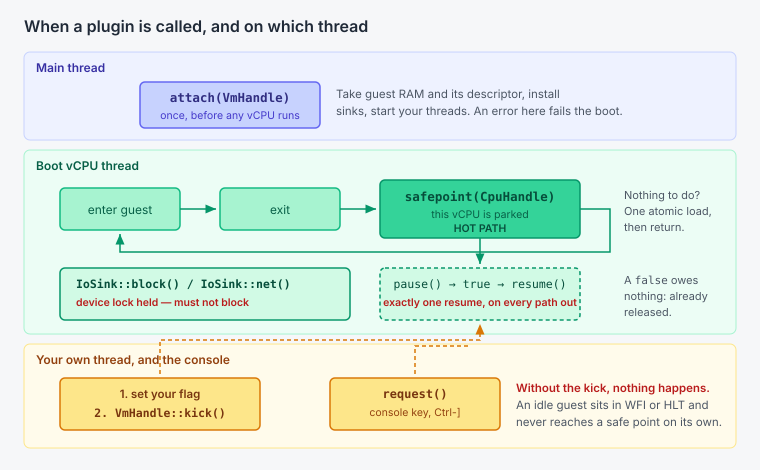

# Writing a tool

A VMM is a useful place to stand. It holds the guest's memory, it can park the
vCPUs between guest entries, and it is the other end of every virtio request
the guest makes. Debuggers, tracers, profilers and crash-dumpers want one or
more of those, and none of them belongs in the exit loop.

So the exit loop offers them instead. That offer is
[`src/plugin.rs`](../src/plugin.rs), and it is four traits wide.

[`examples/watch_guest.rs`](../examples/watch_guest.rs) is a complete
extension in one file, compiled by CI. Read it alongside this page. The two
tools in [`src/plugins.rs`](../src/plugins.rs) are the larger worked examples.

For constructing the `BootConfig` that carries a plugin, read
[embedding.md](embedding.md).

## When each hook runs



| Trait | Called | Thread |
| --- | --- | --- |
| `Plugin::attach` | once, from `boot()`, before any vCPU thread exists and before the sandbox is entered | main |
| `Plugin::safepoint` | between guest entries, only when `cpu_id == 0` | the boot vCPU |
| `Plugin::request` | when the console reads `Ctrl-]` (0x1d) | the console input thread |
| `IoSink::block`, egress `IoSink::net` | per request or frame, device lock held | a vCPU thread |
| ingress `IoSink::net`, under `--net-tap` or `--net-gateway` | per frame, device lock held | the tap or gateway reader thread |
| ingress `IoSink::net`, under the built-in `--net-stub` stack | per reply, device lock held | a vCPU thread, inside the transmit path |

All three methods on `Plugin` are defaulted, so an implementation takes only
what it needs. All three backends call all three hooks.

## The four rules that fail quietly

**1. `safepoint` is on the hot path.** It sits at the top of the vCPU run
loop, so it runs once per guest entry. A tool with nothing to do this time
round must establish that with one atomic load and return.

**2. A pause you win, you owe.** `cpu.pause()` parks every *other* vCPU and
returns `true` once they are all there. You then owe exactly one `resume()`,
on every path out, including early returns and error paths. Miss one and the
VM stays parked forever.

`false` means they did not all park within 500 ms. The quiesce has already
been released, and you owe nothing. Returning without a `resume()` on that
path is correct.

```rust
if !cpu.pause() {
    return;                 // correct: pause already released it
}
let sample = read_what_you_need(cpu);
cpu.resume();               // before anything that can fail or return
report(sample);
```

**3. Set a flag, then kick.** If your own thread decides it is time to act,
set your flag and then call `VmHandle::kick()`. An idle guest sits in WFI on
arm64 or HLT on x86 and does not reach `safepoint` on its own, so without the
kick your request waits for the next unrelated exit, or never lands.

This is the easiest thing to get wrong, and it fails only against idle guests,
which is to say not on your desk.

`kick()` is not identical across backends. The macOS backend breaks every vCPU
out of the hypervisor. The two KVM backends kick the boot vCPU only, which is
the one that reaches the hook.

**4. An `IoSink` must not block.** It is called with the device lock held. No
`write(2)`, no allocation you can avoid. Count in the sink, set a dirty flag,
and do the writing in `safepoint`, where slow things are allowed. `IoTrace` is
the worked example.

## Reading guest memory

`CpuHandle::ram()` borrows the VMM's own mapping, which is writable. If your
tool only reads, prefer mapping your own read-only view from
`VmHandle::ram_fd()` and `ram_regions()`, as `MemoryDump` does. It costs one
`mmap` at attach and makes a class of bug structurally impossible: a tool
holding `PROT_READ` pages cannot corrupt the guest it is inspecting, however
wrong the rest of it is.

Guest RAM is not always one span. `ram_regions()` returns one region on arm64.
On x86-64 it returns one region up to 3328 MiB of guest RAM and two above
that, because RAM stops at the MMIO hole and resumes at 4 GiB. Read
`ram_regions()`. Do not assume a count. Each region's `gpa`, `size` and
`file_offset` are multiples of 1 MiB.

Guest RAM is allocated from a memfd on Linux and a POSIX shared-memory object
on macOS, unlinked as soon as it is created, so `ram_fd()` is a descriptor
another process can map and no other process can open by name.
`hvi smoke --shm` proves that path on macOS.

`RegsView::root` is the architectural translation-base register, TTBR1_EL1 on
arm64 or CR3 on x86-64. The traits hand over access and deliberately no more.
What any of it means is your problem, which is what keeps a tool's idea of the
guest out of the VMM.

## Putting records in the ledger

A tool's records go into the same `--events` stream as the VMM's own:

```rust
#[derive(serde::Serialize)]
struct MyPayload { interesting: u64 }

if let Ok(mut led) = cpu.ledger().lock() {
    led.emit_payload("boundary", "my-source", &MyPayload { interesting });
}
```

The envelope is this crate's and its wire shape is pinned by tests. The
payload is yours, and the VMM never looks inside it. That is the whole of the
coupling between a ledger reader and whatever produced a record.

The stream is buffered and drained on continued traffic, not on a timer. See
[observability.md](observability.md#the-event-ledger).

## Panics

On the macOS backend the vCPU loop runs under `catch_unwind`. A panic in
`safepoint`, in the block sink, or in the egress net sink is reported with the
vCPU, its last exit reason and its program counter, the quiesce is released so
no vCPU stays parked, and the VM stops.

Two things that hook does not cover, on any backend:

- `attach` runs before any vCPU thread exists, so a panic there is not caught
  by it.
- The Linux and x86 backends have no `catch_unwind` around the vCPU loop, and
  their `stop_all` does not release the quiesce.

## Running several

A boot takes one plugin. `plugins::Chain` runs several, forwarding each hook
to every member in insertion order. `attach` stops at the first error.

## What this is not

- **Not a dynamically loadable plugin system.** The crate builds as an rlib.
  There is no `cdylib`, no `dlopen`, no `libloading`. A tool is linked at
  compile time.
- **Not a stable ABI.** There is no released version and no tag. Pin a commit.
- **Not separately confined.** A plugin runs inside the VMM process, under the
  same Seatbelt profile or seccomp filters, with the same authority. A plugin
  is part of the trusted VMM, not a sandboxed guest of it.

## Shipping one out of tree

```toml
[dependencies]
hvi = { git = "https://github.com/brig-sh/hvi-vmm", rev = "<commit>" }
```

Pin a fixed point, not a branch. `hvi --version` reports the VMM core a binary
was built against, and that is only worth printing if the core is a fixed
thing. No tag is published yet, so pin a `rev`.
